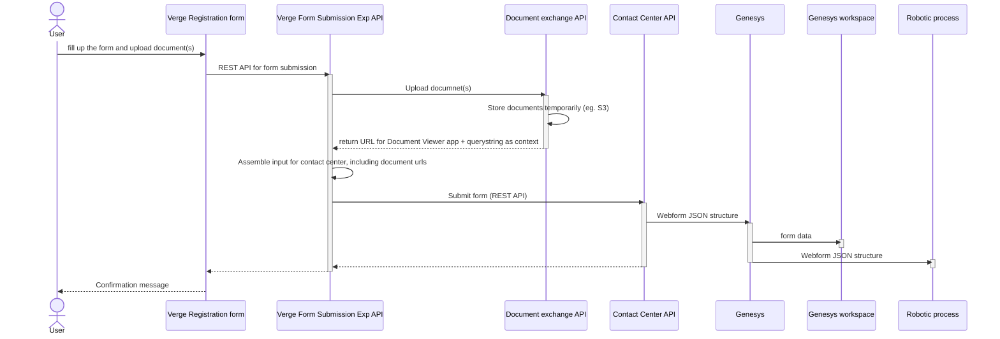
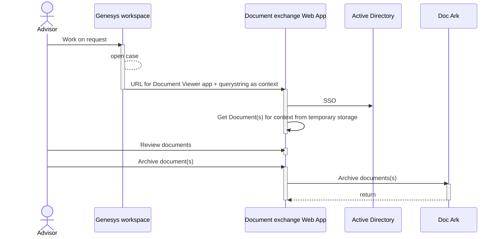

## User


- Customer upload documents in the Webform, but keep the document in the browser.
- On form submission, captured data and uploaded document are submitted to API.
- From API, upload document to S3 through Document Exchange API. In return get <b>application URL to access the document </b>
- Add <b>application URL to access the document </b> to Webform payload. An example as below,.

```json
{
    "webformName": "Verge form",
    "webformVersion": "1",
    "timestamp": "2022-09-30T12:18:44.668Z",
    "routingTag": "PMO:Kontoapne:Verge:Rollerogtilganger",
    "from": "",
    "to": "no-reply@dnb.no",
    "subject": "Verge form",
    "content": [
        {
            "label": "Oppsummering",
            "key": "SUMMARY_HEADER",
            "value": "",
            "contentFormat": "HDR"
        },
        {
            "label": "List of Accounts to change :",
            "value": "",
            "key": "CHANGE_ACCOUNTS_LIST",
            "contentFormat": "LIST",
            "listValues": [
                {
                    "value": [
                        {
                            "label": "Kontodetaljer for konto nr.:",
                            "value": "1",
                            "key": "CHANGE_ACCOUNT_COUNT"
                        },
                        {
                            "label": "Kontonummer",
                            "key": "CHANGE_ACCOUNT_NUMBER",
                            "value": "12266706780"
                        }

                    ]
                },
                {
                    "value": [
                        {
                            "label": "Kontodetaljer for konto nr.:",
                            "value": "2",
                            "key": "CHANGE_ACCOUNT_COUNT"
                        },
                        {
                            "label": "Kontonummer",
                            "key": "CHANGE_ACCOUNT_NUMBER",
                            "value": "12266702351"
                        }

                    ]
                }
            ]
        }
    ],
    "lookupItems": [
        {
          "lookupId": "Endpoint with querystring to get document for this context",
          "querystring": "",
          "tag": ""
        }
    ]
}
```

## Advisor



- Advisor open the case in Genesys Workspace
- Click link <b> application URL to access the document </b>
- A browser open ups to  redirect to Document exchange web app
- Web app redirect to Azure AD for SSO
- Once SSO, web app get documents from S3.
- Advisor previews documents
- Archive the document to Doc Ark


### Timeline
- 
